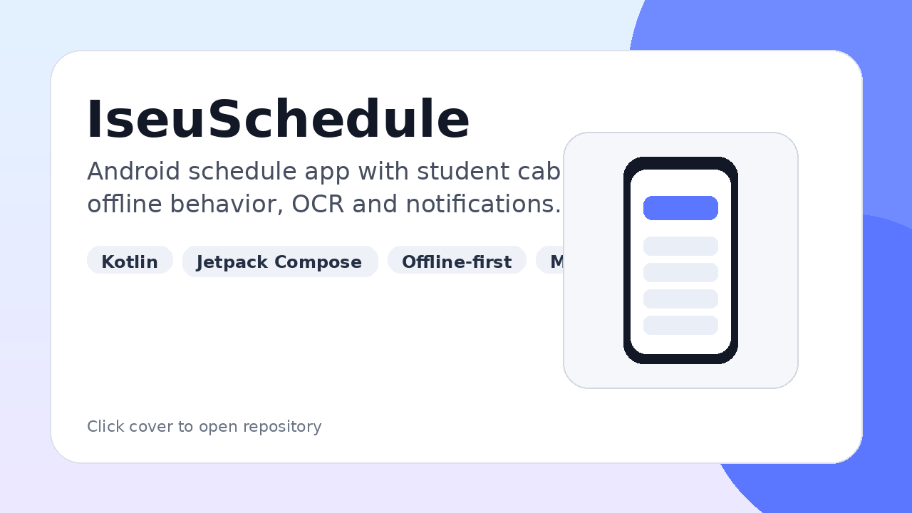

# Yaroslav — Android Developer

I build Android products and MVPs with Kotlin, Jetpack Compose and product-oriented architecture.

My focus is not just writing separate screens. I build mobile applications as working systems: product flow, UI structure, app architecture, data layer, local storage, state management, offline behavior and reliable user logic.

## Portfolio

  <a href="projects/android.md"><b>Android Products</b></a>
  ·
  <a href="projects/python.md"><b>Automation & Python</b></a>
  ·
  <a href="projects/all.md"><b>All Projects</b></a>

## What I work on

- Android MVP development from product flow to working mobile implementation
- Android app structure and architecture for small and medium products
- Feature design and implementation
- Existing app refactoring and stabilization
- UI implementation from Figma with Jetpack Compose
- Local storage, offline-first logic and data synchronization
- Notifications, reminders and background app behavior
- Mobile app UX structure and product flow
- Automation tools and computer vision prototypes with Python

## Featured projects

### IseuSchedule

Android application for university schedule and student cabinet flows.

**What it shows:** Android architecture, Compose UI, data layer, offline behavior, OCR-assisted login, notifications and product-style app logic.  
**Stack:** Kotlin, Jetpack Compose, Room, DataStore, Retrofit, OkHttp, Coroutines, Flow, ML Kit.  
**Repository:** [IseuSchedule_V2](https://github.com/YARIGAVGAN/IseuSchedule_V2)

### AirCursor

Python application for controlling the cursor with hand gestures using computer vision.

**What it shows:** application architecture outside Android, domain logic, adapters, infrastructure layer, safety mechanisms, documentation, tests and CLI tooling.  
**Stack:** Python, OpenCV, MediaPipe, PyAutoGUI.  
**Repository:** [AirCursor](https://github.com/YARIGAVGAN/AirCursor)

## Tech focus

### Android

Kotlin, Jetpack Compose, Android SDK, Coroutines, Flow, Room, DataStore, Retrofit, OkHttp, Material 3, ML Kit, local notifications.

### Architecture and engineering

Feature-based structure, data/domain separation, state management, repository pattern, offline-first behavior, error handling, refactoring, documentation.

### Additional tools

Python, OpenCV, MediaPipe, PyAutoGUI, Git, GitHub Actions, Markdown.

## Current focus

I am focused on Android products and MVPs where the result is a working mobile application, not isolated code fragments.

Typical projects I am interested in:

- mobile MVPs for small products;
- internal Android apps for business workflows;
- schedule, booking, catalog, tracker and reminder apps;
- Android apps with local storage and offline behavior;
- redesign and rebuild of existing mobile app flows;
- automation or computer vision prototypes when Python is the right tool.

## Contact

GitHub: https://github.com/YARIGAVGAN  
Email: yarossa.y@gmail.com
