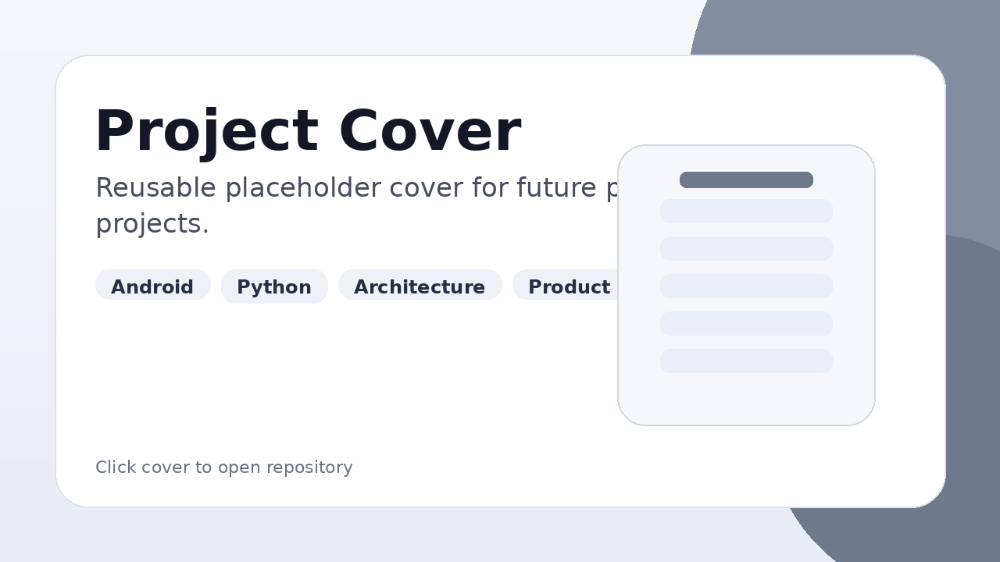

# Android Products

This section contains Android applications and MVP-style projects built with Kotlin, Jetpack Compose and product-oriented architecture.

Click a project cover or repository link to open the source code.

[← Back to profile](../README.md)

---

## IseuSchedule

Android application for university schedule and student cabinet flows.

### What the project includes

- student and teacher schedule flows;
- student cabinet login and registration;
- OCR-assisted captcha handling;
- local schedule caching;
- offline behavior;
- academic results;
- local lesson notifications;
- state restoration after network changes and device reboot.

### My role

I designed and implemented the Android architecture, Compose UI, data layer, local persistence, network handling, OCR flow, notification logic and product behavior.

### Stack

Kotlin, Jetpack Compose, Room, DataStore, Retrofit, OkHttp, Coroutines, Flow, ML Kit, Material 3.

### What it demonstrates

- product-style Android development;
- feature-based app structure;
- local-first data handling;
- offline behavior;
- state management;
- integration with unstable external data sources;
- user flow implementation from app logic to UI.

### Links

Repository: [IseuSchedule_V2](https://github.com/YARIGAVGAN/IseuSchedule_V2)

---

## Future Android project

Short product description.

### My role

Describe what you personally built.

### Stack

Kotlin, Jetpack Compose, Room, DataStore, Retrofit.

### What it demonstrates

- app architecture;
- feature implementation;
- offline logic;
- UI structure;
- real product flow.

### Links

Repository: [Open repository](https://github.com/YARIGAVGAN)
