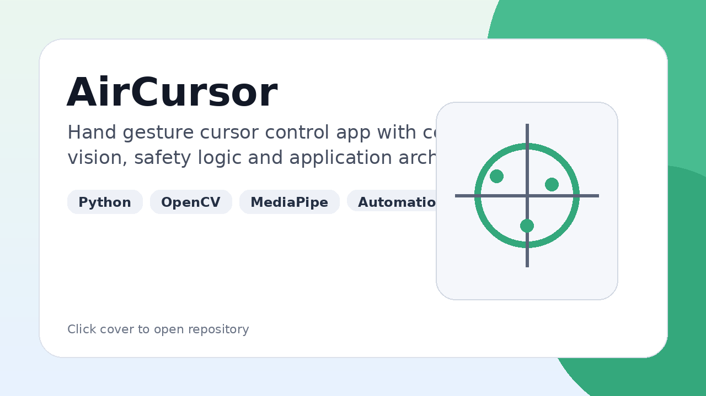

# Automation & Python

This section contains Python projects focused on automation, computer vision, tooling and application architecture outside Android.

Click a project cover or repository link to open the source code.

[← Back to profile](../README.md)

---

## AirCursor

Python application for controlling the cursor with hand gestures using computer vision.

### What the project includes

- hand tracking;
- gesture detection;
- cursor control;
- safety mechanisms;
- calibration flow;
- CLI tooling;
- documentation;
- tests.

### My role

I designed and implemented the application structure, domain logic, adapters, infrastructure layer, gesture control flow, safety behavior, documentation and project tooling.

### Stack

Python, OpenCV, MediaPipe, PyAutoGUI.

### What it demonstrates

- application architecture outside Android;
- domain/application/adapters separation;
- computer vision prototype development;
- safety-oriented interaction design;
- documentation and test structure.

### Links

Repository: [AirCursor](https://github.com/YARIGAVGAN/AirCursor)

---

### Links

Repository: [Open repository](https://github.com/YARIGAVGAN)
